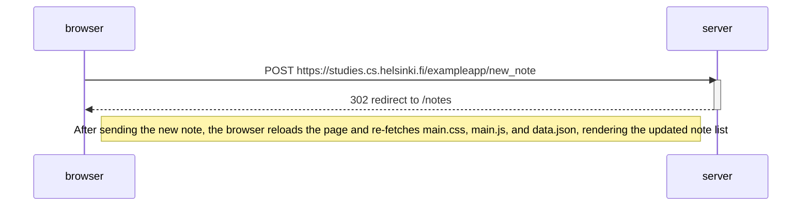

```mermaid
sequenceDiagram
    participant browser
    participant server
    browser->>server: POST https://studies.cs.helsinki.fi/exampleapp/new_note
    activate server
    server-->>browser: 302 redirect to /notes
    deactivate server
    Note right of browser: After sending the new note, the browser reloads the page and re-fetches main.css, main.js, and data.json, rendering the updated note list
```